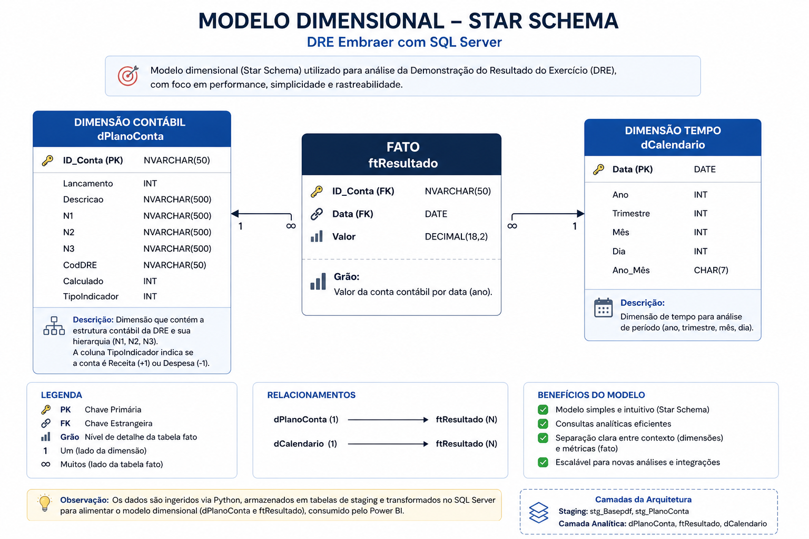

# 📊 DRE Embraer | Arquitetura SQL Server + Power BI

Este projeto tem como objetivo construir uma solução de dados para análise da DRE (Demonstração do Resultado do Exercício) da Embraer, a partir de dados públicos disponibilizados em relatórios financeiros (PDF e Excel).

A DRE é um dos principais relatórios contábeis, permitindo analisar receita, custos, despesas e lucro ao longo do tempo — sendo essencial para tomada de decisão.

---

## 🚧 Contexto

Os dados estavam disponíveis em formatos não estruturados (PDF) e semi-estruturados (Excel), o que dificultava:

* Padronização das análises
* Reutilização dos dados
* Escalabilidade da solução
* Governança e rastreabilidade

Inicialmente, desenvolvi uma versão em Power BI consumindo diretamente esses arquivos.

Embora funcional, esse modelo apresentava limitações como:

* Dependência de arquivos locais
* Risco de quebra do relatório
* Processamento repetitivo no Power BI
* Baixa governança de dados

---

## 🔗 Projeto anterior (Power BI)

👉 [*DRE Automatizada – Análise Financeira*](https://github.com/rsdiniz-data/dre-analise-financeira-powerbi)

---

## 🚀 Evolução da Solução

Evoluí o projeto para uma arquitetura baseada em SQL Server, com pipeline estruturado:

* Ingestão de dados com Python
* Armazenamento em SQL Server
* Modelagem em camadas (staging e camada analítica)
* Transformações centralizadas no SQL

Com isso:

* O Power BI passa a consumir dados já tratados
* Há ganho de performance e confiabilidade
* Redução de processamento no front-end
* Maior controle e governança dos dados

Mais do que uma evolução técnica, foi a transição de um modelo baseado em arquivos para uma arquitetura de dados mais robusta e escalável.

---

## 📌 Navegação

* 📄 [Justificativa](./docs/01_justificativa.md)
* 🏗️ [Arquitetura](./docs/02_arquitetura.md)
* ⚙️ [Desenvolvimento](./docs/03_desenvolvimento.md)
* 💡 [Entrega de Valor](./docs/04_dicionario_dados.md)
* 📊 [Dicionário de Dados](./docs/05_entrega_valor.md)

---

## 📊 Arquitetura

* SQL Server como camada central
* Python para ingestão
* Modelo dimensional (Star Schema)
* Power BI como camada de consumo

📷 

---

## 🔄 Pipeline

Python → Staging → Transformações SQL → Camada Analítica → Power BI

---

## 💻 Scripts

* 📥 [Ingestão Python](./scripts/python/01_ingestao_dados.py)
* 🧱 [Criação de tabelas](./scripts/sql/01_criar_tabelas.sql)
* 🔄 [Transformações](./scripts/sql/02_transformacoes.sql)

---

## 📈 KPIs

* Receita Líquida
* Lucro Bruto
* Margem
* Variação YoY

---

## 🔮 Simulações

* Impacto de Receita
* Impacto de Custos
* Cenários What-If no Power BI

---

## 💡 Valor para o Negócio

* Centralização de dados
* Redução de risco operacional
* Escalabilidade
* Governança

---

## 📢 Links

📊 [Acessar dashboard interativo]((https://app.powerbi.com/view?r=eyJrIjoiOTcwN2E4OTMtNGUxMS00MDBjLTg3MjMtNzQzOWM0OWE0Y2I0IiwidCI6IjE2YjQyY2M1LTJiZWUtNDRjZS05MWE4LWYyMjgwMGRkZmZmYyJ9)
📢 [Ler artigo completo](#)

---

## 🚀 Evoluções Futuras

* Data Warehouse em Cloud (Azure / AWS)
* Orquestração com Airflow
* APIs financeiras
* Camada semântica (dbt)

---

## ✅ Conclusão

Este projeto demonstra a evolução de uma solução de BI baseada em arquivos para uma arquitetura moderna de dados, com foco em performance, governança e escalabilidade — aproximando-se de práticas de Engenharia de Dados.

# 📊 DRE Embraer | Arquitetura SQL Server + Power BI

Evoluí meu projeto de DRE em Power BI para uma arquitetura baseada em SQL Server.

No primeiro momento, os dados vinham direto de arquivos (PDF e Excel), o que funcionava… mas trazia limitações como dependência de arquivos, risco de quebra e pouca governança.

Nesta nova versão, construí um pipeline estruturado:

• Ingestão de dados com Python  
• Armazenamento em SQL Server  
• Modelagem em camadas (staging e camada analítica)  
• Transformações centralizadas no SQL  

Com isso, o Power BI passa a consumir dados já tratados, ganhando performance e confiabilidade.

Além disso, a centralização evita o desperdício de processamento repetitivo no Power BI.

Mais do que uma evolução técnica, foi a transição de um modelo baseado em arquivos para uma arquitetura de dados mais robusta e escalável.

---

## 📌 Navegação

- 📄 [Justificativa](./docs/01_justificativa.md)
- 🏗️ [Arquitetura](./docs/02_arquitetura.md)
- ⚙️ [Desenvolvimento](./docs/03_desenvolvimento.md)
- 💡 [Entrega de Valor](./docs/04_entrega_valor.md)
- 📊 [Dicionário de Dados](./docs/05_dicionario_dados.md)

---

## 📊 Arquitetura

- SQL Server como camada central
- Python para ingestão
- Modelo dimensional (Star Schema)
- Power BI como camada de consumo

📷 

---

## 🔄 Pipeline

Python → Staging → Transformações SQL → Camada Analítica → Power BI

---

## 💻 Scripts

- 📥 [Ingestão Python](./scripts/python/01_ingestao_dados.py)
- 🧱 [Criação de tabelas](./scripts/sql/01_criar_tabelas.sql)
- 🔄 [Transformações](./scripts/sql/02_transformacoes.sql)

---

## 📈 KPIs

- Receita Líquida
- Lucro Bruto
- Margem
- Variação YoY

---

## 🔮 Simulações

- Impacto de Receita
- Impacto de Custos
- Cenários What-If no Power BI

---

## 💡 Valor para o Negócio

- Centralização de dados  
- Redução de risco operacional  
- Escalabilidade  
- Governança  

---

## 📢 Links

📊 [Acessar dashboard interativo](#)  
📢 [Ler artigo completo](#)

---

## 🚀 Evoluções Futuras

- Data Warehouse em Cloud (Azure / AWS)
- Orquestração com Airflow
- APIs financeiras
- Camada semântica (dbt)

---

## ✅ Conclusão

Este projeto demonstra a transição de um BI tradicional para uma arquitetura moderna de dados, com foco em escalabilidade, governança e performance.
